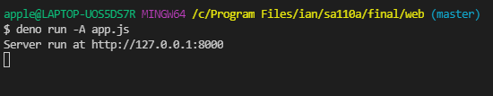
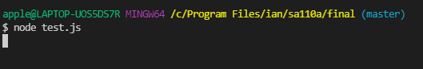

# 期末專案: 網站測試(部分原創部分非原創結尾說明)

* 先寫程式再寫測試

* 緣由 : 這學期在修老師的另一門課網站設計進階，課程有提到關於網站的自動化測試，於是就決定使用網站做測試。

* 使用 Puppepeer 實現自動化測試

* 安裝 Puppepeer
<pre>
在專案資料夾打開terminal

使用兩個指令

$ npm init -y

$ npm i puppeteer

安裝完成
</pre>
* Puppeteer介紹 :
<pre>
Puppeteer 大部分的行為都是非同步的（都是 Promise 的方法），因為無法確認網頁點擊後多久後開啟，也無法確認輸入文字需要多長的時間。

Promise 搭配 async、await 就能將程式碼轉成類似於同步的語言。

所以使用 Puppeteer 時會看到很多 await ...，目的是要確保原始碼可以依序執行。
</pre>

* 在寫puppeteer測試時我常用到以下這幾個指令

<pre>
await browser.newPage() 新增一個分頁

await page.goto() 括號內是 url 路徑

await page.waitForTimeout(): 讓頁面靜止，括號內可以設定時間單位為毫秒

page.click(selector[options])：點擊特定的元素

page.type(selector, text[options])：在特定的元素上輸入文字內容，通常是 input 上輸入

await page.goBack() : 回到上一頁
</pre>

* 實作
<pre>
先在 web 資料夾底下執行 app.js 啟動伺服器

開啟另一個終端機執行測試檔 test.js

結果呈現

<video src="https://youtu.be/1hd5PtTHkN4" controls height=500 width=700></video>

</pre>

* 創作說明
<pre>
web資料夾內 app.js render.js 網站架構參考自老師網站設計進階課程 https://gitlab.com/ccc110/ws/-/tree/master/07-session/03-blogSignup

新增一個日曆的畫面自網路 https://www.youtube.com/watch?v=Q2x84RdNVUY&t=3159s&ab_channel=%E5%BD%AD%E5%BD%AD%E7%9A%84%E8%AA%B2%E7%A8%8B

以上兩者參考內容皆完全理解，並新增星期幾的畫面，還有調整前後月份的button，並改寫為可以點選日期產生創建貼文的畫面 

test.js 測試檔則為原創
</pre>

