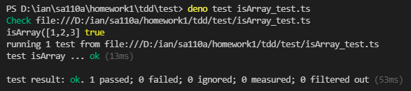

# ._isArray TDD模式

## 先寫測試再寫程式

* isArray function: 
<pre>
Checks if value is classified as an Array object.
</pre>
* exaple: 
<pre>
_.isArray([1, 2, 3]);
// => true
 
_.isArray(document.body.children);
// => false
 
_.isArray('abc');
// => false
</pre>

## 寫測試
<pre>
import { assertEquals } from "https://deno.land/std@0.63.0/testing/asserts.ts";
import * as _ from "../src/isArray.ts";

Deno.test("isArray", () => {
    assertEquals(_.isArray([1,2,3,4,5]),true)
    assertEquals(_.isArray(['a', 'b', 'c', 'd']), true)
    // assertEquals(_.isArray("1234"),false )
  })
</pre>
## 寫程式
<pre>
//_.isArray([1, 2, 3]);
// => true
 
//_.isArray(document.body.children);
// => false
 
export function isArray(list:any[]){
    return Array.isArray(list)
}
console.log("isArray([1,2,3]",isArray([1,2,3]))
//console.log("isArray(abc)", isArray("abc"))
</pre>
* 執行測試結果 

