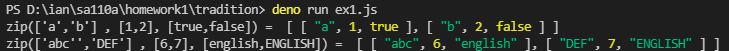

# ._zip 傳統模式

* zip function: 
<pre>
Creates an array of grouped elements, the first of which contains the first elements of the given arrays, the second of which contains the second elements of the given arrays, and so on.
</pre>
* exaple: 
<pre>
_.zip(['a', 'b'], [1, 2], [true, false]);
// => [['a', 1, true], ['b', 2, false]]
</pre>

* Result 

