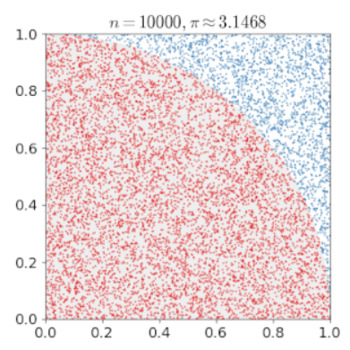
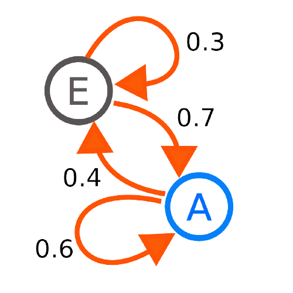
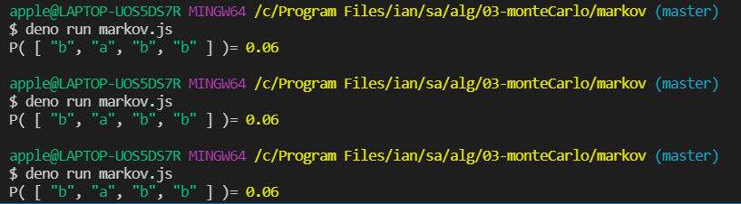
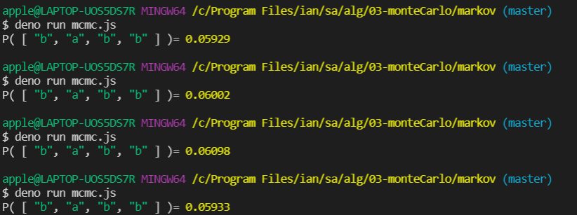

# 蒙地卡羅法學習筆記

<p>蒙地卡羅法:利用亂數隨機抽樣的方式達成計算某種解答的演算法</p></br>

* 以蒙地卡羅法實現圓周率</br>


<p>Code</p>

``` 
function monteCarloPi(n) {
  let hits = 0 
  for (let i=0;i<n; i++) { 
    let x = Math.random() 
    let y = Math.random()
    if (x*x+y*y <= 1) hits++  
  }
  return 4*(hits/n)
}
console.log('MonteCarloPi(1000000)=', monteCarloPi(1000000)) 
```

<pre>
hits表示紅色區域的點在程式開始設值為0，將x,y分別取0-1之間的亂數。
若x,y分別平方之後相加小於等於0，表示在園內則增加hits++
透過一個很大的值進行測試，標準差越小
最後回傳pi的值 因為示意圖是四分之一個pi但實作目標是pi的值所以(hits/n)需乘上4
</pre>

<p>執行結果:</p>
</br>

<pre>
執行結果也同時凸顯出蒙地卡羅法的特點，非常接近真實的值。
每一次執行結果不會相同，因為利用亂數產生樣本進行測試。
</pre>

-------------------------------------------------------------------------
</br>
* 馬可夫鏈介紹

</br>
<P>示意圖:</p>
</br>
<pre>
可以看到示意圖上的馬可夫鏈有兩個狀態E、A。
數字表示狀態轉移的機率(為固定機率)，並且每一個狀態機率相加必須等於1。
</pre>

* 實作一馬可夫練計算出狀態b => a => b => b 的機率
<pre>
 狀態機率： P(a) = 0.2, P(b) = 0.8
 轉移機率： P(x => y)
    a   b
 a  0.7 0.3
 b  0.5 0.5
 </pre>
 <a href = "https://gitlab.com/ccc110/sa/-/blob/master/alg/03-monteCarlo/markov/prob.js">狀態列表</a>
 <a href = " https://gitlab.com/ccc110/sa/-/blob/master/alg/03-monteCarlo/markov/markov.js">實作程式</a>

<p>結果呈現</p>
</br>
<pre>
可以看到無論執行多少次結果都會等於0.06。因為該程式並未加入蒙地卡羅法，而是利用
(先得到b的初始狀態，乘上b狀態轉到a的機率再乘上a狀態轉到b狀態的機率，最後乘上
下一次b狀態停留在b狀態的機率)計算出 狀態b => a => b => b 的固定機率為0.06
</pre>

* 實作一馬可夫練計算出狀態b => a => b => b 的機率(利用蒙地卡羅法)

<p>程式區塊(//為註解)</p>
<pre>
import {P} from './prob.js'//上方"狀態列表"的超連結

const rnd = Math.random
function mcmc(s) { // Monte Carlo Markov Chain
  if (rnd() > P[s[0]]) return 0 //利用0-1的亂數做初始狀態判斷是不是P(b) 如果不是return 0
  for (let i=1; i<s.length; i++) {
    let key = s[i-1]+'=>'+s[i]
    if (rnd() > P[key]) return 0  //依序檢測是否為['b', 'a', 'b', 'b']
  }
  return 1 //是的話才回傳1
}

function markov(s, n) {
  let pass = 0
  for (let i=0; i<n; i++) {
    pass += mcmc(s)
  }
  return pass/n; //回傳做了n次共有幾次是符合狀態b => a => b => b
}

const seq = ['b', 'a', 'b', 'b']

console.log('P(', seq, ')=', markov(seq, 100000)) //通過中央極限定理得知 樣本數越多越接近常態分佈 標準差越小

</pre>

<p>執行結果:</p>
</br>
<pre>
利用蒙地卡羅法實作的例子可以發現程式裡加入了隨機亂數作為狀態的判斷
並且執行100000次的檢測，每一次執行的結果都非常接近實際的機率0.06。
</pre>

資料來源說明
<p>程式</p>
<a href = "https://gitlab.com/ccc110/sa/-/tree/master/alg/03-monteCarlo/markov">老師上課使用的教材</br></a>
</br>
<p>圖片取自維基百科</p>
 <a href = "https://zh.wikipedia.org/wiki/%E8%92%99%E5%9C%B0%E5%8D%A1%E7%BE%85%E6%96%B9%E6%B3%95">圓周率圖片</a>
</br>
<a href = "https://zh.wikipedia.org/wiki/%E9%A9%AC%E5%B0%94%E5%8F%AF%E5%A4%AB%E9%93%BE">馬可夫鏈示意圖</a>

